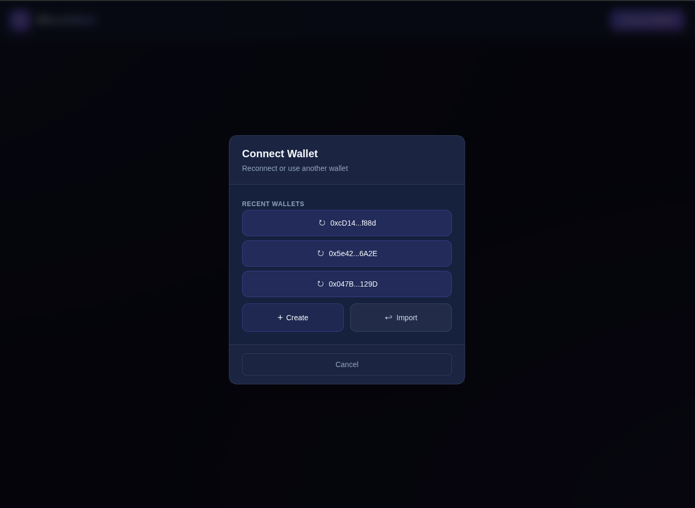

# BlockMail

A decentralized email app where you can send encrypted messages between Ethereum addresses.  
Messages are end-to-end encrypted, stored on IPFS, and metadata is recorded on the Ethereum blockchain.

## Key Features

- Send & receive messages between Ethereum wallet addresses
- End-to-end encryption with **perfect forward secrecy** (each message uses a fresh key)
- Message content stored privately on **IPFS** (via Pinata)
- Metadata (sender, recipient, timestamp, IPFS link) saved on-chain
- Beautiful desktop app built with Electron + React

## How Encryption Works (Quick Overview)

1. You generate a personal X25519 key pair in the app.
2. Your public key is saved on the blockchain (via KeyRegistry contract).
3. When sending a message:
   - The app creates a temporary (ephemeral) key just for that message.
   - Encrypts the content so only the recipient can read it.
   - Uploads the encrypted message to IPFS.
4. The recipient decrypts it using their private key + the temporary public key you shared.

→ Even if someone's long-term key is compromised later, old messages stay private.

**Note**: You cannot read messages you sent to others (this is by design for maximum privacy).

---

## Screenshots




---

## Quick Start

### Step 1: Install dependencies

From the repo root:

```bash
npm install
```

### Step 2: Configure the app environment

Create the app env file and set contract addresses and RPC URLs (you’ll fill in the contract addresses after deploying in Step 5):

```bash
cp packages/app/.env.example packages/app/.env
```

Edit `packages/app/.env`. For local development you’ll typically use:

```env
# Contract addresses (update after Step 5 with the addresses printed by the deploy script)
VITE_CONTRACT_ADDRESS=0x5FbDB2315678afecb367f032d93F642f64180aa3
VITE_KEY_REGISTRY_ADDRESS=0xe7f1725E7734CE288F8367e1Bb143E90bb3F0512

# Local Hardhat node
VITE_RPC_URL=http://127.0.0.1:8545
VITE_WS_URL=ws://127.0.0.1:8545

# Pinata IPFS (get from https://app.pinata.cloud)
VITE_PINATA_JWT=your_pinata_jwt_here
VITE_PINATA_GATEWAY=your_gateway_subdomain.mypinata.cloud
```

### Step 3: Start the local blockchain

In a **first terminal**, start the Hardhat node:

```bash
npm run contracts:node
```

Leave this running. The node will listen at `http://127.0.0.1:8545`.

### Step 4: Deploy the smart contracts

In a **second terminal**, from the repo root, deploy to the local node:

```bash
npm run contracts:deploy:local
```

The script will print something like:

```bash
BlockMail deployed to: 0x... chainId: 31337
KeyRegistry deployed to: 0x... chainId: 31337
```

### Step 5: Update app env with deployed addresses

Copy the **BlockMail** and **KeyRegistry** addresses from the deploy output into `packages/app/.env`:

- `VITE_CONTRACT_ADDRESS` = BlockMail address
- `VITE_KEY_REGISTRY_ADDRESS` = KeyRegistry address

Save the file.

### Step 6: Start the Electron app

In the same second terminal (or a new one), from the repo root:

```bash
npm run app:start
```

The BlockMail desktop app window should open. You can use the local Hardhat accounts (and their private keys in the Hardhat output) to connect and test.

---

## Project Folders

- `packages/app` → The Electron + React desktop application
- `packages/contracts` → Solidity smart contracts & deployment scripts

## License

This project is licensed under the MIT License - see the [LICENSE](LICENSE) file for details.
